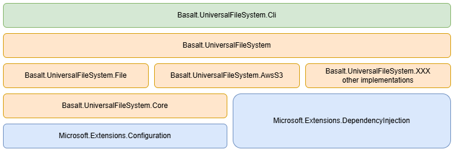
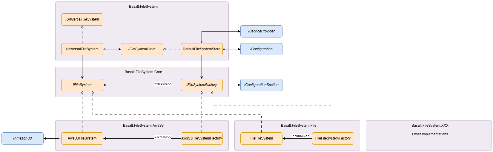


# Basalt.UniversalFileSystem Repository Overview

- `Basalt.UniversalFileSystem` libraries provide a uniform way to access different filesystems via interfaces and configurations.
- `Basalt.UniversalFileSystem.Cli` is built on top of `Basalt.UniversalFileSystem` library to access different filesystems from command line.

## Architecture

`Basalt.UniversalFileSystem` uses `Microsoft.Extensions.Configuration` and `Microsoft.Extensions.DependencyInjection` to get and create implementations for different filesystems.

- `IUniversalFileSystem`, the only interface exported which provides methods to access filesystems.
- `UniversalFileSystem`, implementation of `IUniversalFileSystem`.
- `IFileSystemStore` interface is responsible to create `IFileSystem` for different filesystems.
- `DefaultFileSystemStore`, default implementation of `IFileSystemStore` which creates and maintains`IFileSystem` instances for different configurations.
- `IFielSystemFactory`, abstraction of filesystem factory. Implementations should use configuration passed in to create `IFileSystem` objects. 
- `IFileSystem`, abstraction of all filesystem implementations.
- `AwsS3FileSystemFactory`, AWS S3 implementation of `IFielSystemFactory`. It reads configurations to create `AwsS3FileSystem` object with credentials and options.
- `AwsS3FileSystem`, AWS S3 implementation of `IFileSystem`. It uses AWS SDK to access S3.

## Package Documents
- [Basalt.UniversalFileSystem](./Basalt.UniversalFileSystem.md)
- [Basalt.UniversalFileSystem.Core](./Basalt.UniversalFileSystem.Core.md)
- [Basalt.UniversalFileSystem.File](./Basalt.UniversalFileSystem.File.md)
- [Basalt.UniversalFileSystem.Memory](./Basalt.UniversalFileSystem.Memory.md)
- [Basalt.UniversalFileSystem.AwsS3](./Basalt.UniversalFileSystem.AwsS3.md)
- [Basalt.UniversalFileSystem.AzureBlob](./Basalt.UniversalFileSystem.AzureBlob.md)
- [Basalt.UniversalFileSystem.AliyunOss](./Basalt.UniversalFileSystem.AliyunOss.md)
- [Basalt.UniversalFileSystem.Cli](./Basalt.UniversalFileSystem.Cli.md)
